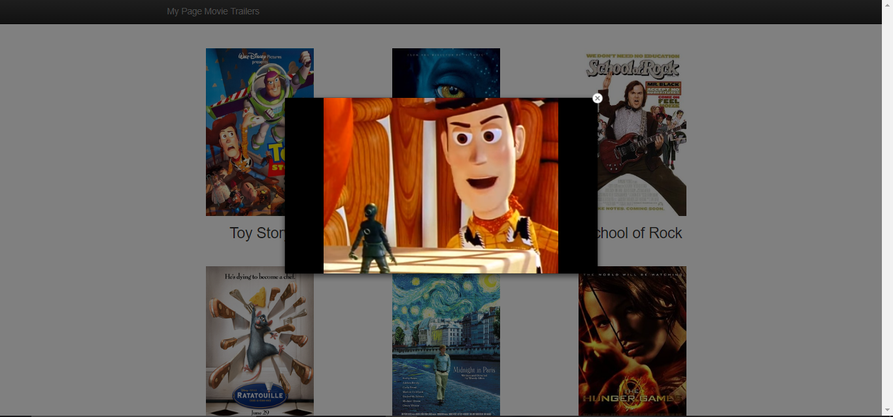

# Python Movie Website

## Python code to generate a movie trailer website.

 1. To use it , [clone the repository](https://github.com/DipanshKhandelwal/Python-Movies-Website.git) in your pc.
 2. First install python.
 3. If you have python installed just run the launch.py file.
 
## Screenshots
 
 
